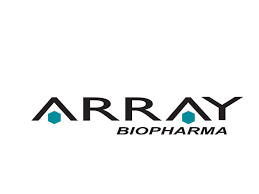

# Summary
A data scientist and clinician, who is committed to make difference in patient's life through analytics. An independent researcher with 6 years of professional experience in healthcare industry. An expert in experimental designs, machine learning, high dimensional data analysis, and statistical analysis with strong technical skills. Coauthor of 20 scientific publications in reputed journals that have been cited 60+ times by scientific community.

# Education
* MS in Biostatistics
* MS in Health Informatics
* MPH in Epidemiology
* BAMS (Equivalent to MD)
* Diploma in Electrical Engineering

# Professional Experience

* April 2018 to Present | **Data Scientist**

* February 2016 to April 2018 | **Data Scientist**

* April 2011 to December 2015 | **Researcher | Statistical Analyst**

* May 2013 to August 2013 | **Biostatistics Intern**

* August 2013 to December 2015 | **Researcher | Data Analyst**

# Core Strengths:

* Machine Learning
* Statistical Analysis
* Experimental designs
* Clinical expertise

# Programming Skills:

* Python
* R
* SAS
* SQL
